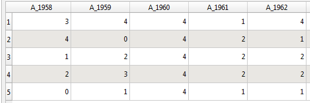

Nel documento:
<!-- TOC -->

- [LAYOUT MULTI MAP](#layout-multi-map)
    - [Elementi di partenza](#elementi-di-partenza)
    - [SCRIPT](#script)
        - [Script1  `01_Auto_gen_layer_and_thematize.py`](#script1--01_auto_gen_layer_and_thematizepy)
        - [Script `02_Auto_composer_ multiple_map_layout.py`](#script-02_auto_composer_-multiple_map_layoutpy)
        - [Dimensione delle mappe](#dimensione-delle-mappe)
    - [FILE DI ESEMPIO](#file-di-esempio)

<!-- /TOC -->

# LAYOUT MULTI MAP 

Questa procedura consistente nell'esecuzione successiva di due script:
*  `01_Auto_gen_layer_and_thematize.py`
*  `02_Auto_composer_ multiple_map_layout.py`

permette la realizzazione di una composizione con n mappe su di un unico layout.

## Elementi di partenza

* Occorre un layer categorizzato in base ad un campo che abbia una parte in comune con gli altri n campi ad esempio come nella figura seguente:

     
    
     dove 'A_' è il prefisso comune a tutti i campi
* quel che determinerà il numero di campi che produrranno i relativi layer è la lunghezza del prefisso infatti se con 'A_' otterrò tutti gli anni con 'A_195', ad esempio, otterrò solo due anni e quindi solo due layer uno relativo al 1958 ed uno relativo al 1959.

## SCRIPT
### Script1  `01_Auto_gen_layer_and_thematize.py`
* Questo script, partendo da un layer tematizzato in funzione di un campo (tipo 'A_1958') **selezionato**, produce tanti layer quanti sono i campi della tabella dati che han identico prefisso nel nome.
* lo script recupera automaticamente il campo di tematizzazione e considera, di default, 2 lettere di prefisso, tale lunghezza può essera variata a piacimento attraverso la variabile **`prefix_lenght`**
* Per esempio se il campo della tematizzazione è 'A_1960' consegue che tutti i campi che iniziano con 'A_' verranno utilizzati, modificando la lunghezza a 4 è possibile restringere a tutti i campi 'A_196' e quindi dal 1960 al 1969.

### Script `02_Auto_composer_ multiple_map_layout.py`
* Questo script partendo dagli n layer tematizzati generati, impostando la variabile **`prefix_layer`**, il numero di righe e colonne desiderate produrrà un layout di stampa in formato A4 *(prossimamente altri formati di pagina)* 
* la variabile `layoutName = "MultiMapLayout"`settata di default a MultiMapLayout darà il nome alla stampa
* Ad esecuzione avvenutà si otterrà una composizione di stampa con mappe multiple.
* 
### Dimensione delle mappe
* Per adeguare la dimensione della mappa in stampa occorre, per adesso, opportunamente zoomare sulla mappa nel canvas.

## FILE DI ESEMPIO
* nella cartella examples il db `MultiMap.gpkg` di esempio.